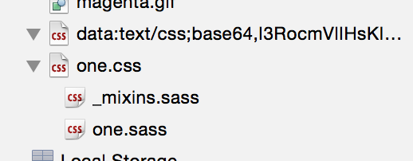

# CSS sourcemap tests

Tests various methods of including CSS in HTML with sourcemaps.

## Tests

* **One** - External CSS file, included via `link` tag.
* **Two** - Inline CSS, via `style` tag.
* **Three** - Data URI as the `href` attribute for `link` tag.

To pass, the `h1` element associated with each test should have a magenta
background and the text should be a particular color (red, blue and yellow
respectively). The background is an external image, used to test support for
external resources in stylesheets included via data URI.

## Results

* **Safari 8** - All visual tests pass. Devtools show support for sourcemaps in
  tests One and Three, but source files are not loaded in the resource view for
  test Three: 

* **Chrome 39** - Visual tests One and Two pass. Background image is not loaded.
  Devtools support sourcemaps in tests One and Three, and all files are loaded
  correctly in the sources pane.

* **Firefox 34** - Visual tests One and Two pass. Background image is not
  loaded. No sourcemap support in development tools for any test.

* **Opera 26** - Visual tests One and Two pass. Background image is not loaded.
  Devtools support sourcemaps in tests One and Three, and all files are loaded
  correctly in the sources pane.
